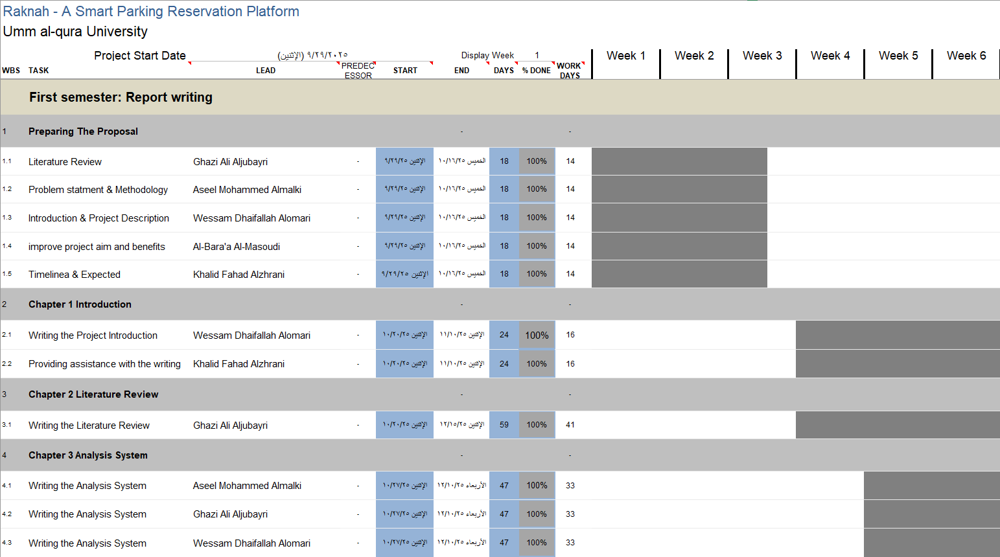

# مشاريعي
## السلام عليكم , انا خالد الزهراني, سأعرض في هذا المستودع ابرز المشاريع التي قمت بالعمل عليها .

## المشروع الأول
**الاسم:** Gantt chart Raknah

**الوصف:** تم إعداد هذا المخطط كجزء من مشروع التخرج ركنه (Raknah). كنت مسؤولًا عن تخطيط الجدول الزمني للمشروع، وإعداد مخطط جانت، وتحديثه ومتابعة تقدم المهام طوال فترة تنفيذ المشروع.
**رابط التحميل:** [تحميل مخطط جانت بصيغة Excel](./Raknah-Gantt-Chart.xlsx)

---
